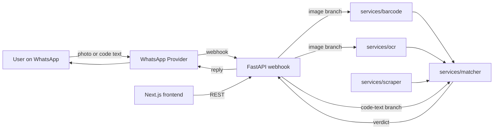

# TrustLens

> Working name. Neutral enough to cover both medicine verification (see [project.md](project.md)) and grocery / consumer-product use cases the team is exploring.

TrustLens turns an everyday product signal — a **photo** of a barcode / QR / label, **or just the typed barcode / QR number** — into an instant authenticity + safety verdict. It is built **WhatsApp-first** for India: zero install, free for consumers, and works on a basic smartphone.

Users can verify in two ways:

1. **Image input** — snap a photo of the pack; the backend decodes the barcode and OCRs the label.
2. **Code input** — type or paste the barcode / QR number directly (useful when the camera can't focus, or when copying a number off a website / invoice).

Both paths converge on the same matcher pipeline, so the verdict is identical.

---

## What lives in this repo

This is a **monorepo**. Each top-level folder is a self-contained workstream with its own `README.md` so any contributor can jump straight in.

| Folder         | Purpose                                                                 |
| -------------- | ----------------------------------------------------------------------- |
| `backend/`     | FastAPI HTTP service (entry point, routes, request/response shapes)     |
| `services/`    | Framework-agnostic Python packages (whatsapp, scraper, ocr, barcode, matcher) |
| `frontend/`    | Next.js admin / dashboard app (scaffold only for now)                   |
| `docs/`        | Architecture notes, research, roadmap                                   |
| `scripts/`     | Dev helpers (run locally, lint, seed)                                   |
| `infra/`       | Deployment artefacts (docker-compose / k8s / etc. — placeholder)        |
| `project.md`   | Product spec (the original MediCheck pitch)                             |

---

## End-to-end data flow



The user sends either a photo or a typed barcode/QR number. For photos, the FastAPI webhook fans out to the barcode + OCR services to extract the same payload. For code text, the route skips decoding and goes straight to the matcher. Both paths feed the matcher engine, which combines those signals with data fetched by the scraper agent, and a plain-language verdict is sent back through WhatsApp. The frontend is for internal admin / B2B dashboards.

---

## Engineering conventions (read before contributing)

These rules keep modules small, testable, and easy to swap.

1. **Backend uses an app-factory pattern.** `backend/app/main.py` builds the FastAPI app; routers, schemas, config, and service-glue each live in their own folder.
2. **Services are framework-agnostic.** Anything under `services/` must be importable from FastAPI, a CLI, or a worker without dragging HTTP concerns along.
3. **One module = one responsibility.** Prefer many small files over one large one. A reader should grasp a module in under a minute.
4. **Comments explain *why*, not *what*.** The code already says what it does. Comments justify trade-offs, list edge cases, or flag TODOs.
5. **Config via `pydantic-settings` reading from `.env`.** Never commit secrets. `.env.example` documents the keys that exist; real values live only on developer machines or in the deployment secret manager.
6. **Tests live next to the package they cover** (`backend/tests/...`, future `services/<pkg>/tests/`).
7. **Type hints everywhere.** They are the cheapest documentation we have.

---

## Quickstart (once code is filled in)

```bash
# Backend
cd backend
python -m venv .venv && source .venv/bin/activate
pip install -r requirements.txt
uvicorn app.main:app --reload

# Frontend (after running create-next-app inside frontend/)
cd frontend
npm install
npm run dev
```

---

## Status

This commit ships the **folder structure, READMEs, and stub files only**. No business logic is implemented yet — every Python entry point is a typed signature with a `TODO` comment describing intent. See [`docs/roadmap.md`](docs/roadmap.md) for what comes next.
