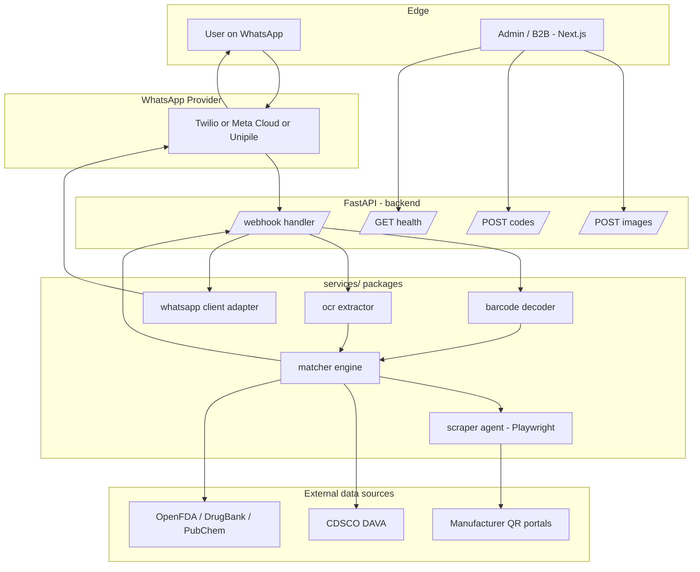

# Architecture

A high-level view of how the TrustLens services fit together. This document is the single source of truth for *how data moves through the system* — implementation details live inside each module's README.

## Goals that shape the design

1. **WhatsApp first, web second.** The primary interface is a chat. The Next.js frontend is for internal / B2B users.
2. **Sub-3-second verdict.** Matching must be parallel (`asyncio.gather`) with strict timeouts — no lookup may block the user reply.
3. **Provider-agnostic WhatsApp.** Twilio vs Meta Cloud vs Unipile is an undecided trade-off — see [`whatsapp-research.md`](whatsapp-research.md). The codebase hides the choice behind a single interface.
4. **Reusable services.** Anything under `services/` must be callable from FastAPI, a CLI, or a background worker without changes.

## Components

## Two input paths, one verdict

TrustLens accepts **two kinds of input** that converge on the same matcher:

| Input        | Carries                                  | Skips                       |
| ------------ | ---------------------------------------- | --------------------------- |
| Image        | photo bytes (camera or upload)           | nothing — runs full pipeline |
| Code text    | the already-decoded barcode / QR string  | `services/barcode` and `services/ocr` |

Why support both? Phone cameras fail in low light, glare, or on glossy packs. A typed code is also the only option when the user is reading a number off a website, an invoice, or a pharmacy bill. From the matcher's perspective these are the same query — only the front of the pipeline differs.

## Request lifecycle — image path (photo -> verdict)

1. User sends a photo to the WhatsApp number.
2. Provider POSTs a webhook to `backend/app/api/routes_whatsapp.py`.
3. The route downloads the media, then calls `services/barcode` and `services/ocr` in parallel.
4. Whichever returns first feeds `services/matcher`, which:
   - hits the official sources (CDSCO, OpenFDA, …),
   - delegates to `services/scraper` for any private manufacturer portal,
   - composes a verdict (score 0–10 + plain-language summary).
5. The route hands the verdict to `services/whatsapp` which sends the reply.

## Request lifecycle — code-text path (typed number -> verdict)

1. User types a barcode / QR number into WhatsApp (or POSTs to `/codes`).
2. The route classifies the inbound text. If it looks like a code (mostly digits, a known length, or a URL containing a batch parameter) it short-circuits the image pipeline.
3. The text is normalised (whitespace stripped, URL → batch param extracted) and handed straight to `services/matcher`.
4. The matcher runs the same parallel lookup + scrape as the image path and returns a `Verdict`.
5. The reply goes back through `services/whatsapp` (or as the JSON response for the REST `/codes` endpoint).

All steps are `async`. Long-running scrapes run in background tasks so the user gets an interim "checking…" reply within the 3 s SLA.

## Why a `services/` layer (not packages inside `backend/`)

Putting verification logic inside the FastAPI app would couple it to HTTP and to a specific framework. A future CLI (`python -m trustlens.verify <image>`), a Celery worker, or a different transport (Telegram, SMS) all need the same matcher / scraper / OCR — so they live one level up.
